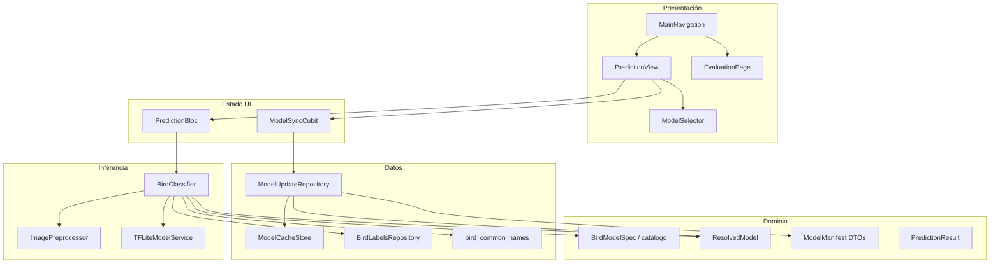
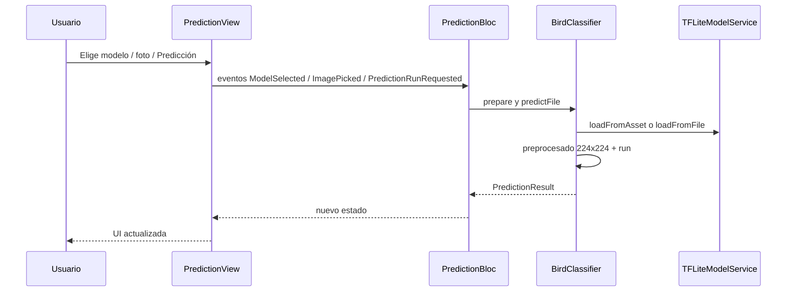
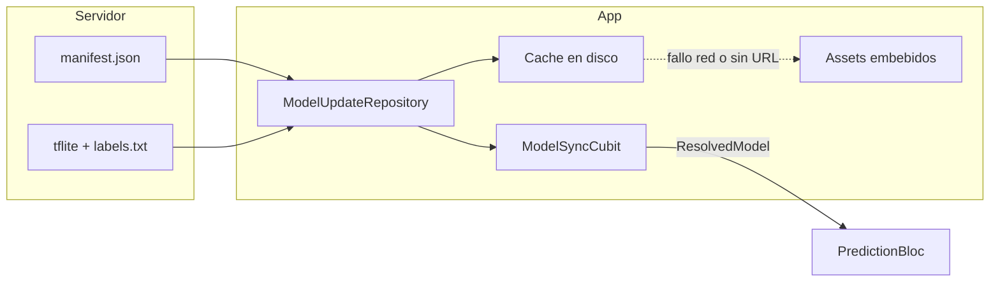

# Go Birds — Arquitectura del proyecto

Documento orientado al equipo: visión general de capas, flujo de datos y sincronización de modelos.

## Estructura de carpetas (`lib/`)

```text
lib/
├── main.dart                 # Punto de entrada: prefs, HTTP client, repositorios
├── app/                      # Shell de la app (MaterialApp + navegación)
├── domain/                   # Tipos y reglas de negocio (sin Flutter UI)
├── data/                     # Acceso a red, disco y preferencias
├── inference/               # TFLite, preprocesado de imagen, clasificación
├── features/prediction/      # Funcionalidad “Predicción” (Bloc + pantalla)
├── pages/                    # Otras pantallas (p. ej. evaluación)
└── widgets/                  # Componentes reutilizables (selector de modelo)
```

## Diagrama de capas

Los módulos de más alto nivel dependen de los de más bajo nivel; `domain` no depende de `data` ni de `inference`.



## Flujo: pantalla de predicción

Desde la acción del usuario hasta el resultado mostrado en pantalla.



## Flujo: sincronización de modelos remotos

Si no hay URL de manifiesto guardada, la app usa solo los modelos empaquetados en `assets/`. Con URL HTTPS, se descargan revisiones y se validan con SHA-256 (cuando el manifiesto trae hashes válidos).



## Archivos clave (referencia rápida)

| Área | Archivo | Rol |
|------|---------|-----|
| Entrada | `lib/main.dart` | `SharedPreferences`, cliente HTTP, construcción de repositorios |
| App | `lib/app/go_birds_app.dart` | `MultiBlocProvider`, tema, `home` |
| App | `lib/app/main_navigation.dart` | Pestañas Predicción / Evaluación |
| Sync | `lib/features/prediction/bloc/model_sync_cubit.dart` | Refresco del manifiesto y catálogo resuelto |
| Predicción | `lib/features/prediction/bloc/prediction_bloc.dart` | Modelo activo, imagen, ejecución de inferencia |
| UI | `lib/features/prediction/presentation/prediction_view.dart` | Layout, botones, `BlocListener` / `BlocConsumer` |
| Red + cache | `lib/data/model_update_repository.dart` | Descarga, verificación, rutas en caché |
| Etiquetas | `lib/data/bird_labels_repository.dart` | Lectura de `classes.txt` desde asset o archivo |
| Inferencia | `lib/inference/bird_classifier.dart` | Orquesta etiquetas + TFLite + top-k |
| Dominio | `lib/domain/bird_model_catalog.dart` | Catálogo fijo de los tres modelos y sus assets |

## Manifiesto remoto (resumen)

El JSON esperado incluye una lista `models` con entradas que coinciden en `id` con `BirdModelSpec.id` del catálogo (`vgg16_aves`, `mobilenet_v2_aves`, `densenet_aves`). Cada entrada suele llevar `revision`, URLs de pesos y etiquetas, y `sha256_*` para comprobar integridad tras la descarga.

Para activar la URL del manifiesto (por código o preferencias), usar `ModelCacheStore` en `lib/data/model_cache_store.dart` (clave interna de preferencias: `go_birds_manifest_url`).
